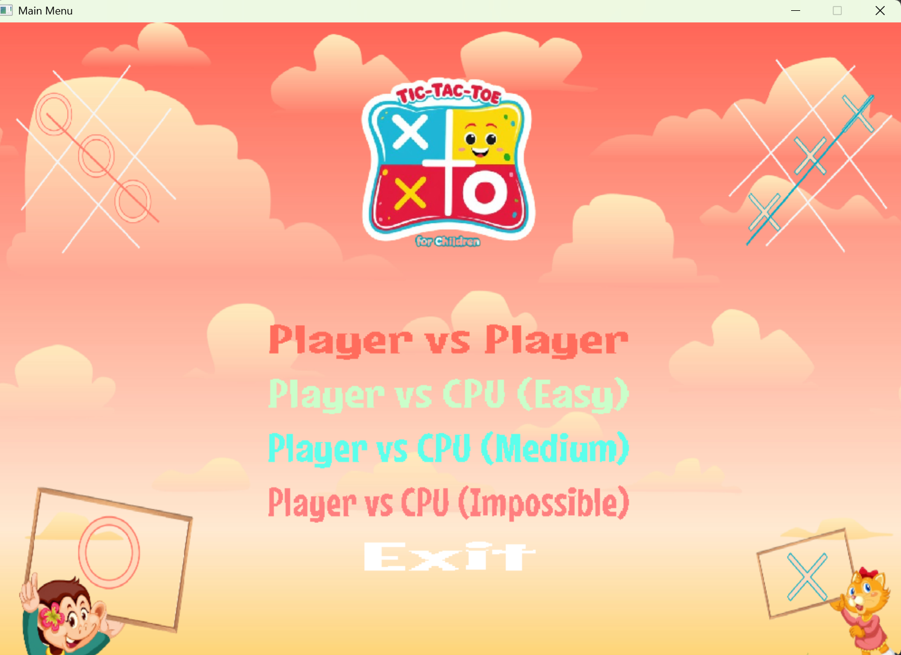
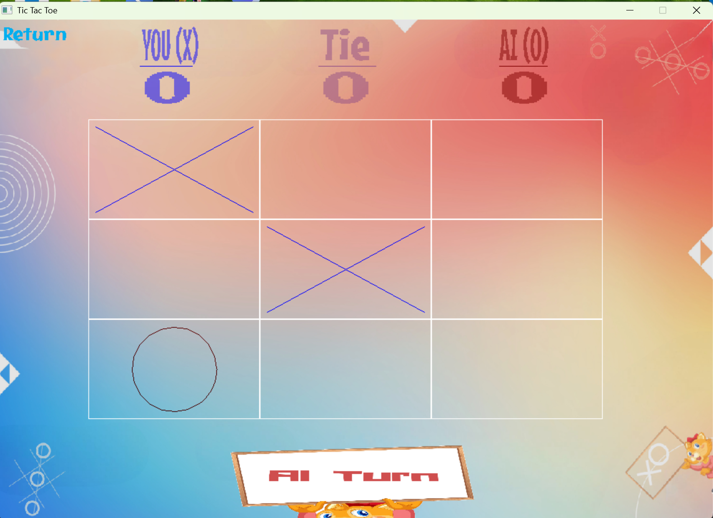

# Tic Tac Toe – Neural Network + Minimax System

## Overview

This project is a Tic Tac Toe game implemented in **C**, featuring both:

* A **Neural Network-based AI**
* A **rule-based Minimax AI system**
* A graphical interface using **SDL2**

The system demonstrates machine learning fundamentals, classical game AI techniques, and full-stack game architecture in a single project.

---

## Key Features

* Neural Network trained on Tic Tac Toe game state dataset
* AI opponent using trained model for move selection
* Traditional Minimax-based AI (perfect play)
* Player vs AI interactive gameplay
* Terminal-based testing interface
* Model evaluation using confusion matrix
* Persistent weight storage for trained model reuse

---

## Neural Network Architecture

The AI uses a simple fully connected feedforward neural network:

* **Input layer:** 9 neurons (Tic Tac Toe board state)
* **Hidden layer:** 10 neurons
* **Output layer:** 1 neuron (win/loss prediction)

### Training Method

* Stochastic Gradient Descent (SGD)
* Sigmoid activation function
* Backpropagation with sigmoid derivative
* 10 training epochs

### Data Processing

* Board encoded as:

  * `x → 1`
  * `o → -1`
  * empty → `0`
* Labels:

  * positive → win (1)
  * negative → loss (0)
* Dataset shuffled and split into:

  * 80% training
  * 20% testing

---

## AI Decision System

During gameplay:

1. AI simulates all possible legal moves
2. Each board state is passed into the neural network
3. The move with the highest predicted score is selected

This allows the model to act as a **policy evaluator for game states**.

---

## Model Evaluation

The system evaluates performance using:

* Confusion Matrix (TP / TN / FP / FN)
* Accuracy score on:

  * training set
  * test set

---

## Tech Stack

* C (core implementation)
* SDL2 (GUI rendering)
* SDL2_ttf (text rendering)
* Custom neural network implementation (no external ML libraries)

---

## Build Instructions

Compile using:

```bash id="c3x9qk"
gcc src/game_logic.c src/gui.c src/init_game.c src/main.c src/menu.c src/multiplayer.c src/neural_network.c src/render.c src/tic_tac_toe_imperfect_minimax.c src/tic_tac_toe_minimax.c -o TicTacToe -I src/include -L src/lib -lmingw32 -lSDL2main -lSDL2 -lSDL2_ttf
```

---

## Running the Program

Ensure the required DLL files are in the executable directory:

* SDL2.dll
* SDL2_ttf.dll

Run:

```bash id="8m2kql"
./TicTacToe
```

---

## Project Structure

```
src/
 ├── game_logic.c
 ├── gui.c
 ├── neural_network.c
 ├── tic_tac_toe_minimax.c
 ├── tic_tac_toe_imperfect_minimax.c
 ├── render.c
 ├── menu.c
 ├── main.c
```

---

---
## Screenshots





---

## Notes

* This project was developed as part of a team collaboration.
* My main contributions include:

  * Neural network implementation from scratch
  * Training pipeline (SGD + backpropagation)
  * AI decision system
  * Integration into gameplay loop
